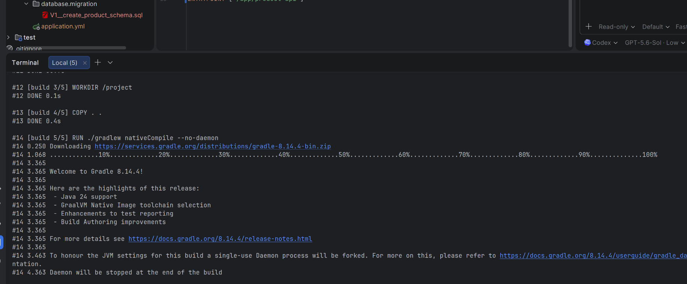
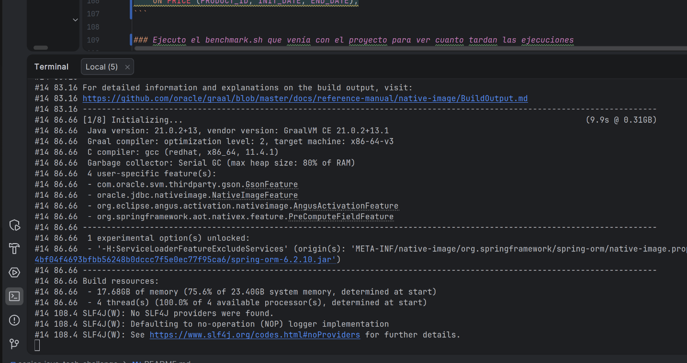
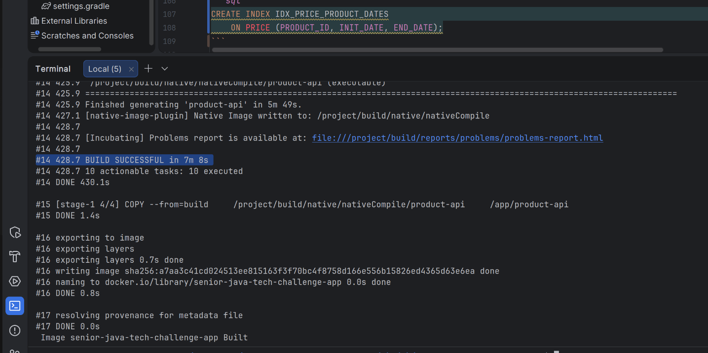
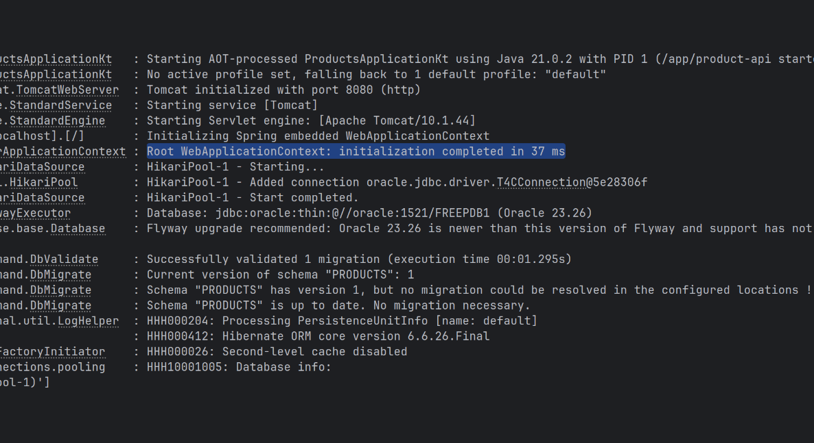

# 🧪 Prueba Técnica – Sistema de Productos con Precios Históricos

## 1. Instrucciones para compilar y ejecutar el proyecto.

Situarse en el directorio donde se encuentra el docker-compose.yml y ejecutar docker compose up.

## 2. Justificación de decisiones técnicas.

### SpringBoot JPA

He creado las dos entidades para las dos tablas que necesito en esta implementación.

También añadidos los repositorios que tienen las queries para obtener la información que necesito de la base de datos.

### Flyway para crear y actualizar el esquema de la db

Flyway se encargará de crear y versionar el esquema de la base de datos. Los cambios en la base de datos se realizarán
ordenadamente y todos los componentes del equipo tendrán la versión de datos actualizada.

### Creación del contract.yml

Para generar automáticamente la interfaz que implementará el controller (definir los endpoints).

### Arquitectura Hexagonal

Imprescindible para no tener que modificar la lógica de negocio si surgen cambios en la parte de infraestructura.

### Tests MockK

Me ha parecido lo más óptimo ya que estoy codificando con Kotlin.

## 3. Indicaciones si agregaste mejoras, asumiste supuestos o cambiaste los endpoints.

### Modificación de los endpoints

He modificado el endpoint GET /products/{id}/ *prices*?date=2024-04-15 cambiando el prices por price, ya que lo que
quiero obtener es el precio del producto para la fecha específica y considero que se entiende mejor en singular. La otra
opción se interpretaría como aplicar el filtro de la fecha en la colección de precios del producto, pero me parece menos
entendible.

Al id le he llamado productId para que se interprete su significado de manera más sencilla.

## 4. Mejora del rendimiento

### Tiempo de arranque de la aplicación sin ninguna optimización (benchmark deshabilitado)

TIEMPO DE ARRANQUE SIN OPTIMIZACIONES: Root WebApplicationContext: initialization completed in 12095 ms

### Tiempo de arranque de la aplicación con mejoras (benchmark deshabilitado)

- Estoy usando Flyway, para que se encargue de mantener estable y actualizado el esquema de la base de datos. Así,
  Hibernate no se encargará de analizar el esquema, se reducirá el tiempo. Modifico SPRING_JPA_HIBERNATE_DDL_AUTO:
  update a validate en el docker-compose.yml, y en el application.yml.

```yml
  SPRING_JPA_HIBERNATE_DDL_AUTO: validate
```

```yml
  jpa:
    hibernate:
      ddl-auto: validate
    show-sql: false
    properties:
      hibernate:
        format_sql: false
```

- En el application.yml, hago que show-sql y properties.hibernate.format_sql sea false, ya que no lo necesito.

- Hago que la aplicación se compile de manera nativa, para reducir tareas realizadas durante el arranque al compilar la
  aplicación con JVM. La compilación AOT que se produce con graalvm transforma previamente la aplicación en código
  máquina y permite que Spring procese anticipadamente parte de la configuración. Añado el plugin de graalvm native al
  build.gradle. Ahora, para ejecutar naviteCompile, añado el nombre del ejecutable al build.gradle:

```gradle
graalvmNative {
    binaries {
        main {
            imageName = 'product-api'
        }
    }
}
```

- Ahora necesito modificar el Dockerfile para que no me cree un JAR y lo ejecute con la JVM. Modifico el Dockerfile:

```dockerfile
RUN ./gradlew nativeCompile --no-daemon

ENTRYPOINT ["/app/product-api"]
```

- Construyo la imagen debian:bookworm-slim: docker compose build







TIEMPO DE ARRANQUE CON OPTIMIZACIONES: Root WebApplicationContext: initialization completed in 37 ms



### Optimizar tiempo de las queries

- Añado índice para mejorar el rendimiento de las queries en el esquema sql de Flyway:

```sql
CREATE INDEX IDX_PRICE_PRODUCT_DATES
    ON PRICE (PRODUCT_ID, INIT_DATE, END_DATE);
```

### Ejecuto el benchmark.sh que venía con el proyecto para ver cuanto tardan las ejecuciones

Añado a Dockerfile.benchmark el bc para poder ver lo que dura la ejecución:

```text
DURATION=$(echo "$END_TIME - $START_TIME" | bc)
```

### Creación de un nuevo contenedor que ejecuta múltiples peticiones concurrentes

Elijo usar k6 porque a parte de lanzar varias peticiones concurrentes, me aporta métricas.

Me decido por la imagen Docker grafana/k6:latest: https://hub.docker.com/r/grafana/k6

En el script benchmark.sh que se adjunta con el proyecto veo que se dan:

```text
1000 peticiones POST "$BASE_URL/products"
20000 peticiones GET "$BASE_URL/products/$PRODUCT_ID/prices?date=2024-04-15"
15000 peticiones GET "$BASE_URL/products/$PRODUCT_ID/prices"
```

Trato de recrear que se lancen las mismas peticiones en mi archivo `benchmark.js`: me parece más realista que hayan
distintos usuarios lanzando las peticiones, no solo uno.

- product_creation: 25 usuarios virtuales lanzarán en total 1000 peticiones
- price_by_date: 50 usuarios virtuales lanzarán un total de 20000 peticiones
- price_history: 50 usuarios virtuales lanzarán un total de 15000 peticiones

```javascript
scenarios: {
    product_creation: {
        executor: 'shared-iterations',
            exec
    :
        'createProduct',
            vus
    :
        25,
            iterations
    :
        1000,
            maxDuration
    :
        '2m',
    }
,

    price_by_date: {
        executor: 'shared-iterations',
            exec
    :
        'getPriceByDate',
            vus
    :
        50,
            iterations
    :
        20000,
            maxDuration
    :
        '5m',
    }
,

    price_history: {
        executor: 'shared-iterations',
            exec
    :
        'getPriceHistory',
            vus
    :
        50,
            iterations
    :
        15000,
            maxDuration
    :
        '5m',
    }
,
}
```

## 5. Resultados de la ejecución

### Velocidad de ejecución de los endpoints

### Peticiones exitosas por segundo

### Uso de recursos bajo carga

## 6. Entrega

### Archivo docker-compose.yml

Se entrega el archivo docker-compose.yml que levanta la aplicación y ejecuta la herramienta k6 para que se envíen
múltiples peticiones concurrentes.

#### Restricciones importantes:

- **No se podrán modificar los valores de CPU ni memoria del contenedor de la aplicación ni del script de rendimiento**.
- **Puedes añadir nuevos contenedores auxiliares**, siempre que **cada uno tenga un máximo de 1 GB de memoria y 500 Mi
  de CPU**.

Esto te permite aplicar estrategias como separación de servicios, caché, balanceo, precálculo, etc., **pero dentro de
restricciones razonables de infraestructura**.

---

### 2. Otros desafíos opcionales

- Soporte para múltiples monedas por precio.
- Endpoint para actualizar o eliminar precios.
- Autenticación básica o con token.
- Documentación con Swagger/OpenAPI.
- Scripts para poblar datos de prueba automáticamente.
- Soporte para paginación, ordenamiento o filtrado en el historial de precios.
